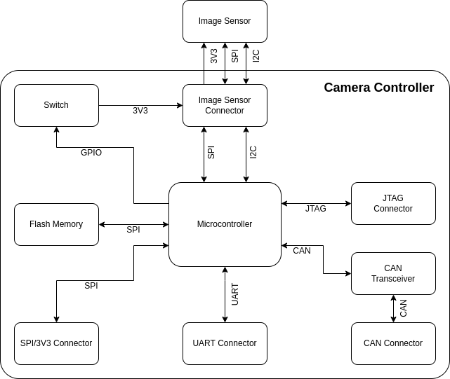

# Hardware

## Block Diagram

## Bill of Materials

| **Component**          | **Description**              | **Partnumber**       | **Quantity** |
|------------------------|------------------------------|----------------------|:------------:|
| Microcontroller        | ARM Cortex M3                | STM32F103C8T6        |       1      |
| Flash Memory           | NOR 128 Mbit                 | W25Q128JVSIM TR      |       1      |
| Switch                 | Load switch                  | TPS22919-Q1          |       1      |
| CAN Transceiver        | CAN transceiver              | TCAN330GD            |       1      |
| SPI/3V3 Connector      | PicoBlade 6 pin              | 532610671            |       1      |
| UART Connector         | PicoBlade 3 pin              | 532610371            |       1      |
| CAN Connector          | PicoBlade 3 pin              | 532610371            |       1      |
| Image Sensor Connector | Female header 8 pin straight | -                    |       1      |
| JTAG Connector         | Male header 4 pin angled     | -                    |       1      |
| Image Sensor Module    | Arducam Mini 2MP Plus        | -                    |       1      |
| Crystal                | 8 MHz crystal                | ECS-80-10-33-CHN-TR3 |       1      |
